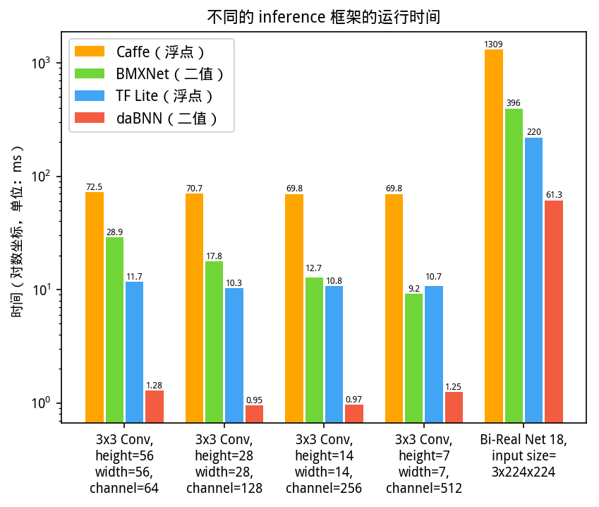

# dabnn

[](https://dev.azure.com/daquexian/dabnn/_build/latest?definitionId=2&branchName=master)
[](LICENSE) 
[](https://bintray.com/daquexian566/maven/dabnn/_latestVersion)
[](https://gitter.im/dabnn/dabnn)
[](https://github.com/JDAI-CV/dabnn/pulls)

[English](README.md) [中文](README_CN.md)

Gitter (English): [dabnn/dabnn](https://gitter.im/dabnn/dabnn)

QQ 群：1021964010, 入群答案: nndab

## 简介

二值网络（Binary Neural Networks，又称 1-bit 网络）是一种特殊的神经网络，它将网络的权重和中间特征压缩为 1 个 bit，可以看作是普通浮点型网络量化到极致的结果。和其它 bit 数稍高的量化网络（例如三值网络、2-bit 网络、4-bit 网络）相比，二值网络最突出的优点在于，1-bit 乘加操作可以通过位运算高效实现，因此可以无缝运行在主流硬件平台（x86、ARM）上，而三值、2-bit、4-bit 等等操作需要特殊硬件平台（FPGA、ASIC）支持。在计算效率上，一个 32 位浮点运算指令只能完成一次浮点乘法或加法运算，但一个 32 位位运算指令可以同时完成 32 个 1-bit 乘法运算。

然而，想发挥出位运算的高效率，就需要用位运算对卷积进行重新实现。一直以来，始终没有人针对二值网络推出一个高度优化的 inference 框架，这让二值网络令人遗憾的失去了可以部署在现有通用设备上这个巨大的优势。

为了填补这个巨大的空白，我们推出了 dabnn，一个用 ARM 汇编重写了卷积，高度优化的二值网络 inference 框架。实验显示 dabnn 相对于现有的二值网络和浮点网络 inference 框架均能带来极大的加速。在运行单个二值卷积时，我们的速度是 [BMXNet](https://github.com/hpi-xnor/BMXNet) （除 dabnn 外唯一一个二值网络 inference 框架） 的 **800%~2400%**，在运行二值化的 ResNet-18 时，我们的速度是 BMXNet 的约 **700%**。我们希望 dabnn 的开源可以成为二值网络部署在终端设备的关键一步，也可以有助于使这一领域的爱好者了解二值网络在真实设备上的表现。

## 速度

Google Pixel 1 上的 benchmark (单线程):

```
2019-05-02 18:00:29
Running data/local/tmp/dabnn_benchmark
Run on (4 X 1593.6 MHz CPU s)
***WARNING*** CPU scaling is enabled, the benchmark real time measurements may be noisy and will incur extra overhead.
--------------------------------------------------------------------
Benchmark                             Time           CPU Iterations
--------------------------------------------------------------------
dabnn_5x5_256                   3658193 ns    3636875 ns        192       <--- input: 14*14*256, kernel: 256*5*5*256, output: 14*14*256, padding: 2
dabnn_3x3_64                    1285949 ns    1261826 ns        552       <--- input: 56*56*64,  kernel: 64*3*3*64, output: 56*56*64, padding: 1
dabnn_3x3_128                    988757 ns     981547 ns        721       <--- input: 28*28*128, kernel: 128*3*3*128, output: 28*28*128, padding: 1
dabnn_3x3_256                   1018918 ns    1008007 ns        689       <--- input: 14*14*256, kernel: 256*3*3*256, output: 14*14*256, padding: 1
dabnn_3x3_256_s2                 269234 ns     268085 ns       2613       <--- input: 14*14*256, kernel: 256*3*3*256, output: 7*7*256, padding: 1, stride: 2
dabnn_3x3_512                   1226245 ns    1203749 ns        579       <--- input:  7* 7*512, kernel: 512*3*3*512, output:  7* 7*512, padding: 1
dabnn_bireal18_imagenet        61809506 ns   61056865 ns         10       <--- Bi-Real Net 18, ImageNet top-1 为 56.4%
dabnn_bireal18_imagenet_stem   43279353 ns   41533009 ns         14       <--- 带有 stem 模块的 Bi-Real Net 18 (将在论文中描述), ImageNet top-1 为 56.4%
```

在 Google Pixel 1 上与 [Caffe](http://caffe.berkeleyvision.org)（全精度）, [TensorFlow Lite](https://www.tensorflow.org/lite)（全精度）和 [BMXNet](https://github.com/hpi-xnor/BMXNet)（二值）的对比如下。我们很惊讶的发现现有的二值 inference 框架 BMXNet 甚至比全精度的 TensorFlow Lite 还要慢，这表明，直到 dabnn 推出之前，二值网络的潜力都远远没有被挖掘出来。



## 如何编译

我们已经提供预编译的 onnx2bnn 和 dabnn 的 Android package，不过如果需要在非 Android 的 ARM 设备上使用 dabnn，就需要自己编译它了。

如同大部分 C++ 项目，我们使用 CMake 构建系统。具体请看 [docs/build.md](docs/build.md)。

## 如何转换 ONNX 模型

我们提供模型转换工具 onnx2bnn 将 ONNX 模型转换为 dabnn 格式的模型。在 [GitHub Releases](https://github.com/JDAI-CV/dabnn/releases) 里有各个平台的 onnx2bnn 预编译二进制文件，可以直接下载运行。Linux 用户我们提供的是 AppImage 格式的二进制文件，AppImage 的使用方法和其它相关信息请参考 https://appimage.org/。

注意：因为二值卷积是一种自定义操作，所以 ONNX 模型是否与 dabnn 兼容极大程度上依赖于训练代码中二值卷积的实现，在 [wiki](https://github.com/JDAI-CV/dabnn/wiki/Train,-export-and-convert-a-dabnn-model) 中有详细的进一步描述。

转换完成后得到的 dabnn 模型就可以在 ARM 设备（例如手机和嵌入式设备）上使用。对 Android 开发者我们已经把 Android AAR 包上传到了 [jcenter](https://bintray.com/daquexian566/maven/dabnn/_latestVersion)，使用方法请看[示例工程](https://github.com/JDAI-CV/dabnn-example)。

## 预训练模型

我们提供两个在 ImageNet 上训练的、基于 [Bi-Real Net](https://arxiv.org/abs/1808.00278) 的二值网络模型，将来还会有其它的模型发布。

* [Bi-Real Net 18](https://drive.google.com/uc?export=download&id=1Oau5CtFR9nWXmlBBU47Jg5ypMiIEMtvo), ImageNet top-1 为 56.4%, 在 Google Pixel 1 上的速度为 61.8ms/image （单线程）。

* [Bi-Real Net 18 with Stem Module](https://drive.google.com/uc?export=download&id=1ArsirMdbtJ9lvHSjc1hkQ7dIXDKh-D1t), ImageNet top-1 为 56.4%, 在 Google Pixel 1 上的速度为 43.2ms/image （单线程）。详细的网络结构将在论文中描述。

## 技术细节

* Binary Convolutions 的实现: [docs/bconv.md](docs/bconv_CN.md)

* 模型转换: [docs/onnx2bnn.md](docs/onnx2bnn_CN.md)

## 示例工程

Android app demo: https://github.com/JDAI-CV/dabnn-example

## 开源许可

[BSD 3 Clause](LICENSE)
