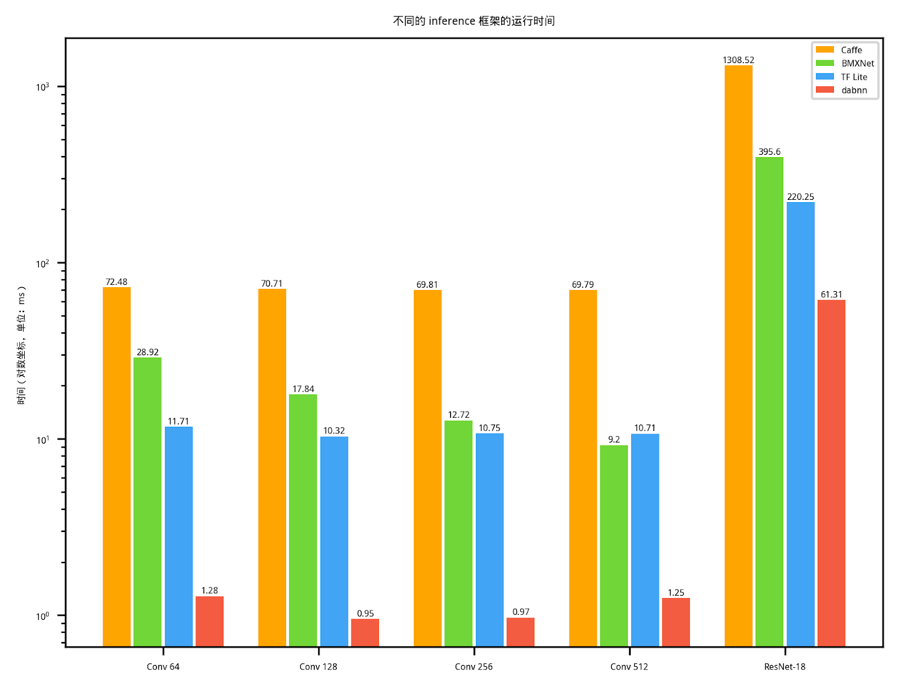

# dabnn

[](LICENSE) 
[](https://github.com/JDAI-CV/dabnn/pulls)

QQ 群：1021964010, 入群答案: nndab

## 简介

二值网络（Binary Neural Networks，又称 1-bit 网络）是一种特殊的神经网络，它将网络的权重和中间特征压缩为 1 个 bit，可以看作是普通浮点型网络量化到极致的结果。和其它 bit 数稍高的量化网络（例如三值网络、2-bit 网络、4-bit 网络）相比，二值网络最突出的优点在于，1-bit 乘加操作可以通过位运算高效实现，因此可以无缝运行在主流硬件平台（x86、ARM）上，而三值、2-bit、4-bit 等等操作需要特殊硬件平台（FPGA、ASIC）支持。在计算效率上，一个 32 位浮点运算指令只能完成一次浮点乘法或加法运算，但一个 32 位位运算指令可以同时完成 32 个 1-bit 乘法运算。

然而，想发挥出位运算的高效率，就需要用位运算对卷积进行重新实现。一直以来，始终没有人针对二值网络推出一个高度优化的 inference 框架，这让二值网络令人遗憾的失去了可以部署在现有通用设备上这个巨大的优势。

为了填补这个巨大的空白，我们推出了 dabnn，一个用 armv8 汇编重写了卷积，高度优化的二值网络 inference 框架。实验显示 dabnn 相对于现有的二值网络和浮点网络 inference 框架均能带来极大的加速。通过 dabnn 的开源，我们希望可以在二值网络的部署，以及了解二值网络的真正潜力上迈出关键的一步。

## 速度

Google Pixel 1 上的 benchmark:

```
2019-05-02 18:00:29
Running data/local/tmp/dabnn_benchmark
Run on (4 X 1593.6 MHz CPU s)
***WARNING*** CPU scaling is enabled, the benchmark real time measurements may be noisy and will incur extra overhead.
-----------------------------------------------------------------
Benchmark                          Time           CPU Iterations
-----------------------------------------------------------------
BM_bgemm_5x5_256             3658193 ns    3636875 ns        192       <--- input: 14*14*256, kernel: 256*5*5*256, output: 14*14*256, padding: 2
BM_bnn_bconv_3x3_64          1285949 ns    1261826 ns        552       <--- input: 56*56*64,  kernel: 64*3*3*64, output: 56*56*64, padding: 1
BM_bnn_bconv_3x3_128          988757 ns     981547 ns        721       <--- input: 28*28*128, kernel: 128*3*3*128, output: 28*28*128, padding: 1
BM_bnn_bconv_3x3_256         1018918 ns    1008007 ns        689       <--- input: 14*14*256, kernel: 256*3*3*256, output: 14*14*256, padding: 1
BM_bnn_bconv_3x3_256_s2       269234 ns     268085 ns       2613       <--- input: 14*14*256, kernel: 256*3*3*256, output: 7*7*256, padding: 1, stride: 2
BM_bnn_bconv_3x3_512         1226245 ns    1203749 ns        579       <--- input:  7* 7*512, kernel: 512*3*3*512, output:  7* 7*512, padding: 1
BM_bireal18_imagenet        61809506 ns   61056865 ns         10       <--- Bi-real Net 18, ImageNet top-1 为 56.4%
BM_bireal18_imagenet_stem   43279353 ns   41533009 ns         14       <--- 带有 stem 模块的 Bi-real Net 18 (将在论文中描述), ImageNet top-1 为 56.4%
```

在 Google Pixel 1 上与 [Caffe](http://caffe.berkeleyvision.org)（全精度）, [TensorFlow Lite](https://www.tensorflow.org/lite)（全精度）和 [BMXNet](https://github.com/hpi-xnor/BMXNet)（二值）的对比如下。我们很惊讶的发现现有的二值 inference 框架 BMXNet 甚至比全精度的 TensorFlow Lite 还要慢，这表明在 dabnn 之前，二值网络的潜力远远没有被挖掘出来。



## 示例工程

Android app demo: https://github.com/JDAI-CV/dabnn-example

## 转换 ONNX 模型

我们提供模型转换工具 onnx2dab 将 ONNX 模型转换为 dabnn 的 .dab 模型。用本地编译工具链（而不是 arm 交叉编译工具链）编译这个项目就可以编译出 onnx2dab。我们很快将提供一个预编译的 AppImage 格式的 onnx2dab。

注意：虽然 ONNX 有 Sign operator，但我们暂时还不支持（不过很快将支持）。所以在导出 ONNX 模型时，请暂时去掉里面的 sign 操作，我们会根据卷积的权重自动判断某个卷积是不是二值卷积。

## 技术细节

我们计划参加 [ACM Multimedia 2019 Open Source Software Competition](https://www.acmmm.org/2019/call-for-open-source-software-competition/). dabnn 的技术细节很快会在一篇四页的短论文中描述。

## 开源许可

[BSD 3 Clause](LICENSE)
